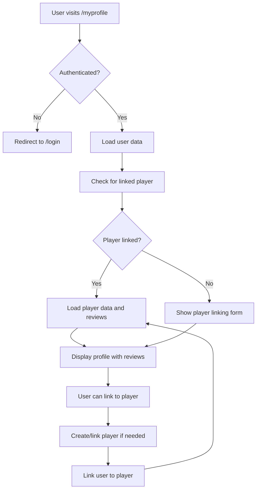

# User Profile Architecture

## Overview
This document describes the implementation of the user profile feature with player linking functionality.

## Components

### 1. UserProfile Page (`/myprofile`)
- Accessible only to authenticated users
- Displays user's Telegram account information
- Allows linking to a player nickname
- Shows reviews by the user and reviews on the user's linked player

### 2. PlayerProfile Page (`/player/:nick`)
- Updated to show a checkmark if the player is linked to the current user

### 3. API Services
New endpoints added to `api.js`:
- `getUserLinkedPlayer()` - Get the player linked to the current user
- `linkUserToPlayer(playerId)` - Link the current user to a player
- `unlinkUserFromPlayer()` - Unlink the current user from their player
- `canUserReviewPlayer(playerId)` - Check if user can review a player (10-day restriction)
- `fetchReviewsByUser()` - Get reviews submitted by the current user
- `fetchReviewsOnLinkedPlayer()` - Get reviews on the user's linked player

## Data Flow

## Features Implemented

1. **User Authentication Check**: Only authenticated users can access the profile page
2. **Player Linking**: Users can link their Telegram account to an in-game player nickname
3. **Automatic Player Creation**: If a player nickname doesn't exist, it's automatically created
4. **Linked Player Verification**: Player profiles show a checkmark if linked to the current user
5. **Review History**: Shows both reviews by the user and reviews on their linked player
6. **10-Day Review Restriction**: Users can only review the same player once every 10 days

## Security Considerations

- All API calls include authentication tokens
- User data is stored securely in localStorage
- Backend validation is required for all user-player linking operations